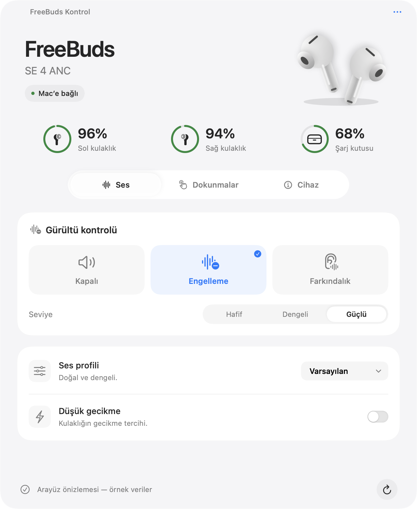
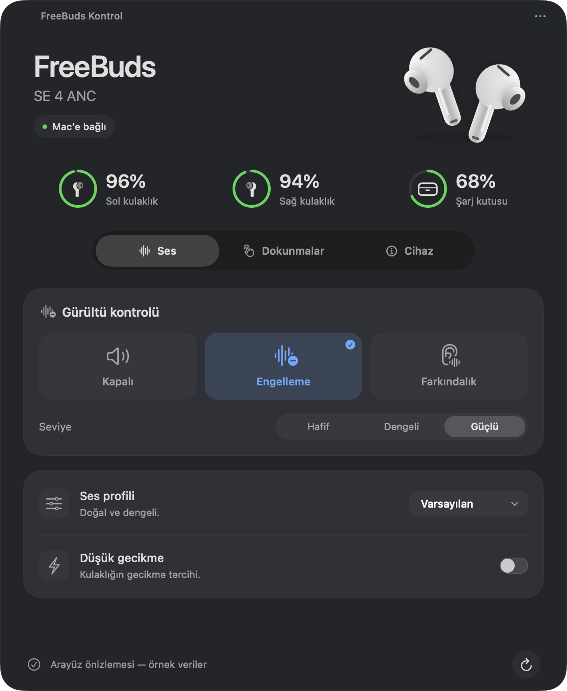

<div align="center">

# FreeBuds Kontrol

**Your FreeBuds. A native Mac control panel.**

[](https://github.com/hikmetozcann/freebuds-kontrol/actions/workflows/ci.yml)
[](https://github.com/hikmetozcann/freebuds-kontrol/releases/latest)
[](LICENSE)
[](#compatibility)

[Download](https://github.com/hikmetozcann/freebuds-kontrol/releases/latest) · [Türkçe](README.tr.md) · [Report a bug](https://github.com/hikmetozcann/freebuds-kontrol/issues/new/choose)

</div>

A small, independent macOS menu bar app for **HUAWEI FreeBuds SE 4 ANC**. Read battery levels, choose a noise mode, and customize gestures directly over Bluetooth. No account, cloud service, or third-party runtime dependencies.

<p align="center">
  
  
</p>

*Interface previews rendered from the app's actual views with example values and reduced transparency. The current app interface is Turkish; English and Turkish documentation are available.*

## What it controls

- **Battery:** separate left earbud, right earbud and case readings, plus charging state when reported.
- **Noise control:** off, noise cancellation and awareness; light, balanced and strong ANC levels.
- **Sound:** default, bass, treble and vocal presets; the earbud's low-latency preference.
- **Gestures:** left/right double-tap, triple-tap and hold actions; noise-mode cycling and the call-answer/end gesture.
- **Device:** model and firmware information, connection status and a shortcut to Bluetooth settings.

Changes are read back from the earbuds before the app reports success. Missing readings stay unknown. The menu bar shows the lower of the two earbud battery levels. Appearance follows macOS, with an optional light/dark override and native glass navigation on macOS 26.

## Compatibility

| Item | Support |
| --- | --- |
| Earbuds | **FreeBuds SE 4 ANC**, model **BTFT0026** |
| Hardware verification | Firmware **1.9.0.199**, macOS **26.3**, Apple Silicon |
| Deployment target | macOS **14 or later** |
| Builds | Apple Silicon (`arm64`) and Intel (`x86_64`); both checked in CI |
| Interface language | Turkish |

Other FreeBuds models are not supported. Intel builds and the older macOS material fallback are not equivalent to hardware validation on every Mac. See [validation scope](docs/VALIDATION.md).

**This app does not add multipoint, simultaneous iPhone/Mac audio, automatic cross-device switching, or firmware flashing.** It manages the earbuds while they are connected to the Mac. Case battery can be the last value known by the earbuds. The low-latency preference is not a measured end-to-end latency guarantee.

## Installation

1. Open [Releases](https://github.com/hikmetozcann/freebuds-kontrol/releases/latest) and download the ZIP matching your Mac: `arm64` for Apple Silicon, `x86_64` for Intel.
2. Extract it and move **FreeBuds Kontrol.app** to **Applications**.
3. Pair/connect the earbuds in macOS Bluetooth settings, then open the app. Allow Bluetooth access if macOS asks.
4. Open the panel from its earbud icon in the menu bar. Closing the window leaves that icon available; use **… → Çıkış** or **⌘Q** to quit.

The release builds are **ad hoc signed, not Developer ID signed or Apple-notarized**. If macOS blocks first launch, review the source/release and follow [Apple's per-app opening guidance](https://support.apple.com/en-us/102445) only if you trust the download. Alternatively, build from source. No system-wide security changes are required by this project.

Each release includes `SHA256SUMS.txt`. With the two ZIPs and that file in the same directory, verify them with:

```sh
shasum -a 256 -c SHA256SUMS.txt
```

### Everyday use

**Ses** contains sound controls, **Dokunmalar** contains gestures, and **Cihaz** contains device information. **… → Görünüm** selects System / Light / Dark. The app polls every 25 seconds; the refresh button reads immediately. It does not automatically start at login.

If the earbuds switch to your phone, the panel waits. Disconnect them from the phone if needed, then choose **Mac’e bağlan**, or connect through macOS Bluetooth settings. Only one management app should use the earbud control channel at a time.

## Build from source

Requires macOS, Xcode or Command Line Tools with the macOS SDK, and Swift 6 or later. Sources compile in Swift 5 language mode. There are no Swift package dependencies.

```sh
git clone https://github.com/hikmetozcann/freebuds-kontrol.git
cd freebuds-kontrol
./build.sh
```

The app is written to `build/FreeBuds Kontrol.app`. The build generates the icon from source, embeds the license and notices, and signs locally. `ARCH=arm64 ./build.sh` or `ARCH=x86_64 ./build.sh` selects a target architecture.

Protocol checks do not require earbuds:

```sh
"build/FreeBuds Kontrol.app/Contents/MacOS/FreeBudsKontrol" --self-test
```

With the GUI closed and your earbuds connected, `--snapshot` prints selected device readings without the Bluetooth address or serial number. **`--smoke-test` changes settings temporarily and attempts to restore them**; see [hardware testing](docs/DEVELOPMENT.md) before using it. Neither hardware command runs in CI.

## Privacy

The app has no analytics, account system, update checker or application network service. It stores the selected paired Bluetooth address and appearance preference in local macOS preferences. Device responses are held in memory; serial numbers are not intentionally persisted or included in snapshot output. Bluetooth permission is used for device communication. External links open only when clicked.

Do not paste Bluetooth addresses, serial numbers or unreviewed diagnostic logs into public issues. See [SECURITY.md](SECURITY.md) for private security reports.

## Contribute

Bug reports, translations, accessibility improvements and carefully verified protocol work are welcome. Start with [CONTRIBUTING.md](CONTRIBUTING.md), [architecture](docs/ARCHITECTURE.md), and [development/release instructions](docs/DEVELOPMENT.md).

## License and credits

**GPL-3.0-only** — see [LICENSE](LICENSE) and [NOTICE.md](NOTICE.md). Protocol work was informed by [OpenFreebuds](https://github.com/melianmiko/OpenFreebuds); thank you to its contributors. All bundled device illustrations are original source drawings. This project is not affiliated with Huawei or Apple.
